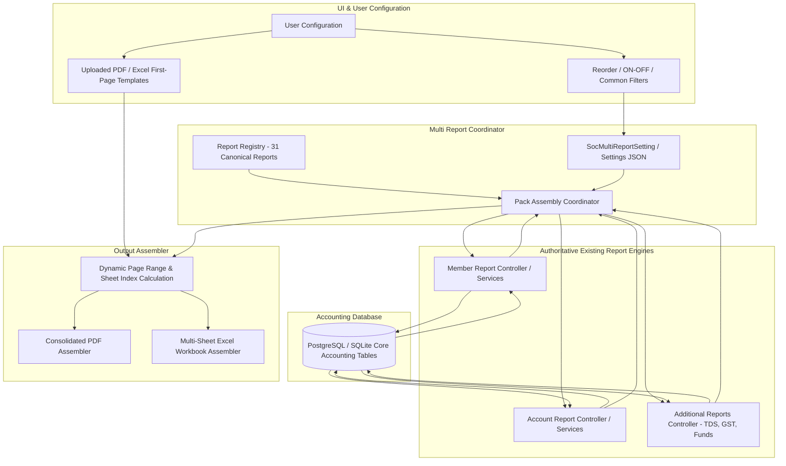

# HENU ERP — Multi Report Pack Builder & Data Lineage Documentation

## 1. Overview
The **Multi Report** module (`ADDITIONAL REPORT → MULTI REPORT`) is a dynamic report orchestration and document assembly engine. It does **not** duplicate accounting business logic or fabricate data. Instead, it coordinates, executes, orders, and compiles existing reports across **Member Reports**, **Account Reports**, and **Additional Reports** into a unified reporting package with a dynamic table of contents / index and custom template integration.

---

## 2. Multi-Report Architecture & Workflow

---

## 3. Comprehensive Report Registry & Data Lineage (31 Reports)

| Sr | Report Display Name | Internal Report ID | Category / Subgroup | Authoritative Controller / Service | Primary Database Tables | Common & Specific Filters | Output Formats |
| :- | :--- | :--- | :--- | :--- | :--- | :--- | :--- |
| **1** | **Bill Format** | `member_bill_format` | Member Reports | `MemberReportController` | `SocMemberBill`, `SocMemberBillItem`, `SocMember` | FY, From/To Date, Wing, Flat | PDF / XLSX |
| **2** | **Receipt** | `member_receipt` | Member Reports | `MemberReceiptController` | `SocMemberReceipt`, `SocMemberReceiptItem`, `SocMember` | FY, From/To Date, Mode, Member | PDF / XLSX |
| **3** | **Debit Note** | `member_debit_note` | Member Reports | `MemberNoteController` | `SocMemberNote`, `SocMember` | FY, From/To Date, Member | PDF / XLSX |
| **4** | **Credit Note** | `member_credit_note` | Member Reports | `MemberNoteController` | `SocMemberNote`, `SocMember` | FY, From/To Date, Member | PDF / XLSX |
| **5** | **Adjustment** | `member_adjustment` | Member Reports | `MemberNoteController` | `SocMemberNote`, `SocMember` | FY, From/To Date, Member | PDF / XLSX |
| **6** | **Outstanding List** | `member_outstanding` | Member Reports | `MemberReportController` | `SocMember`, `SocMemberBill`, `SocMemberReceipt` | FY, As On Date, Wing | PDF / XLSX |
| **7** | **Member Account \| Head wise** | `member_account_headwise` | Member Ledger | `MemberReportController` | `SocMemberBillItem`, `SocAccount`, `SocMember` | FY, From/To Date, Member, Head | PDF / XLSX |
| **8** | **Member Register [Dr/Cr]** | `member_register_drcr` | Member Ledger | `MemberReportController` | `SocMemberBill`, `SocMemberReceipt`, `SocMember` | FY, From/To Date, Wing | PDF / XLSX |
| **9** | **Member Control Account** | `member_control_account` | Member Ledger | `MemberReportController` | `SocMemberBill`, `SocMemberReceipt`, `SocAccount` | FY, From/To Date | PDF / XLSX |
| **10** | **Balance Confirmation Letter** | `balance_confirmation` | Member Ledger | `MemberReportController` | `SocMember`, `SocMemberBill`, `SocMemberReceipt` | FY, As On Date, Member | PDF / XLSX |
| **11** | **Bill Register** | `member_bill_register` | Bill Register | `MemberReportController` | `SocMemberBill`, `SocMember` | FY, From/To Date, Bill Type | PDF / XLSX |
| **12** | **Receipt Register** | `member_receipt_register` | Bill Register | `MemberReceiptController` | `SocMemberReceipt`, `SocMember` | FY, From/To Date, Bank | PDF / XLSX |
| **13** | **Debit Note Register** | `debit_note_register` | Note Register | `MemberNoteController` | `SocMemberNote` (Debit Notes) | FY, From/To Date | PDF / XLSX |
| **14** | **Credit Note Register** | `credit_note_register` | Note Register | `MemberNoteController` | `SocMemberNote` (Credit Notes) | FY, From/To Date | PDF / XLSX |
| **15** | **Adjustment Register** | `adjustment_register` | Note Register | `MemberNoteController` | `SocMemberNote` (Adjustments) | FY, From/To Date | PDF / XLSX |
| **16** | **Member JV Register** | `member_jv_register` | Note Register | `MemberNoteController` | `SocMemberNote`, `SocVoucherHeader` | FY, From/To Date | PDF / XLSX |
| **17** | **Cash/Bank Book** | `cash_bank_book` | Account Reports | `ReportController` | `SocVoucherHeader`, `SocVoucherDetail`, `SocAccount` | FY, From/To Date, Bank/Cash Acc | PDF / XLSX |
| **18** | **Account Ledger** | `account_ledger` | Account Reports | `ReportController` | `SocVoucherHeader`, `SocVoucherDetail`, `SocAccount` | FY, From/To Date, Account Code | PDF / XLSX |
| **19** | **Receipt & Payment Report** | `receipt_payment` | Account Reports | `ReportController` | `SocVoucherHeader`, `SocVoucherDetail`, `SocAccount` | FY, From/To Date | PDF / XLSX |
| **20** | **Trial Balance** | `trial_balance` | Account Reports | `ReportController` | `SocAccount`, `SocOpeningBalance`, `SocVoucherDetail` | FY, From/To Date, Group | PDF / XLSX |
| **21** | **Income & Expenditure** | `income_expenditure` | Account Reports | `ReportController` | `SocAccount`, `SocVoucherDetail`, `SocGroup` | FY, From/To Date | PDF / XLSX |
| **22** | **Balance Sheet** | `balance_sheet` | Account Reports | `ReportController` | `SocAccount`, `SocGroup`, `SocOpeningBalance`, `SocVoucherDetail` | FY, As On Date | PDF / XLSX |
| **23** | **Dues/Advance Ledger** | `dues_advance_ledger` | Account Reports | `ReportController` | `SocMember`, `SocMemberBill`, `SocMemberReceipt` | FY, From/To Date | PDF / XLSX |
| **24** | **Receipt Register (Accounts)**| `account_receipt_register` | Account Reports | `ReportController` | `SocVoucherHeader`, `SocVoucherDetail` (Receipts) | FY, From/To Date | PDF / XLSX |
| **25** | **Payment Register** | `payment_register` | Account Reports | `ReportController` | `SocVoucherHeader`, `SocVoucherDetail` (Payments) | FY, From/To Date | PDF / XLSX |
| **26** | **Contra Register** | `contra_register` | Account Reports | `ReportController` | `SocVoucherHeader`, `SocVoucherDetail` (Contra) | FY, From/To Date | PDF / XLSX |
| **27** | **Journal Register** | `journal_register` | Account Reports | `ReportController` | `SocVoucherHeader`, `SocVoucherDetail` (Journal) | FY, From/To Date | PDF / XLSX |
| **28** | **Monthly Report** | `monthly_report` | Account Reports | `ReportController` | `SocVoucherHeader`, `SocVoucherDetail`, `SocAccount` | FY, Month | PDF / XLSX |
| **29** | **TDS Report** | `tds_report` | Additional Reports | `AdditionalReportsController` | `SocTdsTransaction`, `SocVoucherHeader`, `SocVendor`, `SocTdsChallan` | FY, From/To Date, Section, Status | PDF / XLSX |
| **30** | **GST Report** | `gst_report` | Additional Reports | `AdditionalReportsController` | `SocMemberBill`, `SocMemberBillItem`, `SocVoucherDetail`, `SocVendor` | FY, From/To Date, Month, Taxability | PDF / XLSX |
| **31** | **Fund Reports** | `fund_reports` | Additional Reports | `AdditionalReportsController` | `SocAccount` (Funds), `SocVoucherHeader`, `SocVoucherDetail` | FY, From/To Date, Fund Account | PDF / XLSX |

---

## 4. Index & Assembly Engine Logic

### 4.1 PDF Assembly Flow
1. **Pass 1 (Report Generation)**: Each enabled report is generated via its existing controller endpoint.
2. **Pass 2 (Page Count Measurement)**: The exact page count $P_i$ for report $i$ is calculated from the rendered PDF metadata.
3. **Pass 3 (Index Construction)**:
   $$\text{PageFrom}_i = \text{CurrentPage}$$
   $$\text{PageTo}_i = \text{PageFrom}_i + P_i - 1$$
   $$\text{CurrentPage} = \text{PageTo}_i + 1$$
4. **Pass 4 (Document Merging)**:
   - Section 0: Uploaded Custom Cover/Index PDF (or Dynamic Generated Index)
   - Section 1 $\dots N$: Ordered Enabled Reports
   - Output: `Multi_Report_FY_2026-27.pdf`

### 4.2 Excel Assembly Flow
1. **Sheet 1 (`INDEX - CONTENTS`)**: Contains the society banner and the dynamic table of contents linking every enabled report to its worksheet.
2. **Sheets 2 to $N+1$**: Worksheets generated for each enabled report, prefixed with sequence numbers (e.g. `01 - Bill Format`, `02 - Receipt`, `29 - TDS Report`, `30 - GST Outward`, `31 - Fund Statement`).
3. **Safe Worksheet Naming**: Automatically sanitizes invalid Excel characters (`\ / ? * : [ ]`) and truncates to $\le 31$ characters while ensuring uniqueness.
4. **Output**: `Multi_Report_FY_2026-27.xlsx`

---

## 5. Persistence & Settings Storage
- **Database Table**: `jeevika_erp.SocMultiReportSetting (SocietyId INT PRIMARY KEY, SettingsJson TEXT, UpdatedAt TIMESTAMP)`
- **File System Fallback**: `multi_report_settings.json`
- **Reordering Persistence**: User order changes persist immediately and survive server restarts.
